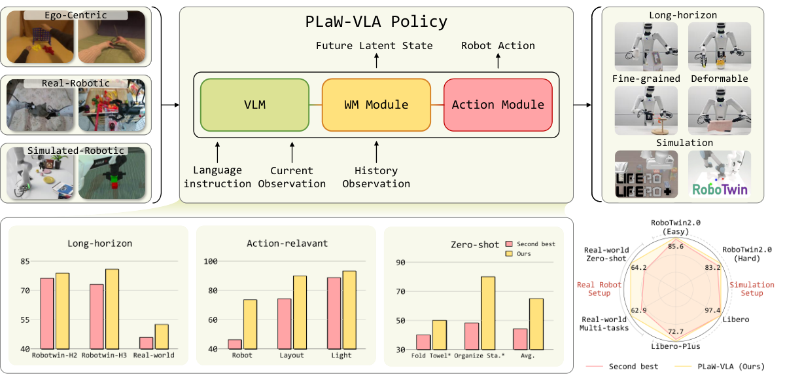

<h1 align="center">PLaW-VLA: Predictive Latent World Modeling for Vision-Language-Action Policies</h1>

<div align="center">

<p>
  <a href="https://arxiv.org/abs/XXXX.XXXXX"></a>
  <a href="https://rainyrobo.github.io/PLaW-VLA/"></a>
  <a href="LICENSE"></a>
</p>

<p>
  Yu Liu<sup>1,2,*</sup>&nbsp;&nbsp;
  Hetian Guo<sup>1,*</sup>&nbsp;&nbsp;
  Tianlv Huang<sup>1</sup>&nbsp;&nbsp;
  Ziyi Cai<sup>3</sup>&nbsp;&nbsp;
  Wudi Chen<sup>1</sup>&nbsp;&nbsp;
  Hantang Wang<sup>4</sup>&nbsp;&nbsp;
  Qiutong Liu<sup>4</sup><br>
  Yingzhi Peng<sup>5</sup>&nbsp;&nbsp;
  Wei Han<sup>1</sup>&nbsp;&nbsp;
  Peijun Tang<sup>2,†</sup>&nbsp;&nbsp;
  Jianan Wang<sup>2,†</sup>&nbsp;&nbsp;
  Zipei Fan<sup>1,‡</sup>&nbsp;&nbsp;
  Zhiyuan Zha<sup>1</sup>&nbsp;&nbsp;
  Xuan Song<sup>1</sup>
</p>

<p>
  <sup>1</sup> Jilin University&nbsp;&nbsp;·&nbsp;&nbsp;
  <sup>2</sup> Astribot&nbsp;&nbsp;·&nbsp;&nbsp;
  <sup>3</sup> Harbin Institute of Technology, Shenzhen<br>
  <sup>4</sup> The Hong Kong Polytechnic University&nbsp;&nbsp;·&nbsp;&nbsp;
  <sup>5</sup> The University of Tokyo
</p>

<p>
  <sub>* Equal contribution.&nbsp;&nbsp; † Project leads.&nbsp;&nbsp; ‡ Corresponding author.</sub>
</p>

<p>
  <strong><em>Conference on Robot Learning (CoRL) 2026</em></strong>
</p>

</div>

<p align="center">
  
</p>

PLaW-VLA is a vision-language-action framework that predicts future visual states in the latent space of a frozen V-JEPA 2 encoder. A Mixture-of-Transformers architecture combines vision-language, latent world-model, and action experts. Learnable future queries connect visual history and language context to future-state prediction, while structured attention allows the action expert to use the predicted representations for continuous action generation.

The training recipe connects video predictive learning to robot policy learning in three stages:

- **Stage I — World-model pretraining:** Learn latent prediction from human and robot videos without action annotations.
- **Stage II — Joint pretraining:** Train future prediction and action generation together on robot trajectories.
- **Stage III — Policy fine-tuning:** Adapt the policy to downstream tasks and embodiments.

This repository provides the model, training pipeline, data preparation tools, and a WebSocket policy server. **LIBERO is the supported benchmark.** Optional RoboTwin and LIBERO-Plus clients are available for research use; support for both remains planned. The `openpi` and `openpi_client` package names follow the upstream implementation.

## Installation

Use Linux with an NVIDIA GPU and a driver compatible with CUDA 12.8. Install [uv](https://docs.astral.sh/uv/getting-started/installation/), then run:

```bash
git clone https://github.com/RainyRobo/PLaW-VLA.git
cd PLaW-VLA
git submodule update --init third_party/libero
GIT_LFS_SKIP_SMUDGE=1 uv sync --python 3.12 --frozen
bash scripts/install_transformers_patch.sh
```

The training and policy environment uses PyTorch with CUDA 12.8. The patch installer checks the pinned Transformers version and installs the PLaW-VLA changes only in the project virtual environment. Run it again after synchronizing or recreating that environment. Conversion tools and simulator clients use separate environments. For a containerized policy server, see [Docker](docs/docker.md).

## Models and data

PLaW-VLA checkpoints are **pending release**. Until then, evaluation requires a checkpoint trained with this repository, including its original `assets/` directory and matching training configuration. The upstream π₀.₅ checkpoint initializes Stage I; it is not a PLaW-VLA evaluation checkpoint.

| Resource | Source | Use |
| --- | --- | --- |
| π₀.₅ base | `gs://openpi-assets/checkpoints/pi05_base` | Stage I initialization, converted to PyTorch |
| V-JEPA 2 encoder | [facebook/vjepa2-vitl-fpc64-256](https://huggingface.co/facebook/vjepa2-vitl-fpc64-256) | Visual latent targets |
| PaliGemma tokenizer | `gs://big_vision/paligemma_tokenizer.model` | Language input |
| LIBERO EEF data | [RainyBot/libero_v3_eef](https://huggingface.co/datasets/RainyBot/libero_v3_eef) | LIBERO fine-tuning |

```bash
# Base models and tokenizer for Stage I.
.venv/bin/python scripts/download_assets.py --stage 1
# LIBERO fine-tuning data, encoder, tokenizer, and normalization statistics.
.venv/bin/python scripts/download_assets.py --stage 3
```

Downloads are cached and existing resources are reused. **The pretraining mixture is not distributed.** Obtain its five source datasets under their respective terms and follow [the data guide](docs/data.md) to prepare local LeRobot datasets.

## Pretraining

[The pretraining guide](docs/pretraining.md) covers the data layout, Stage I and Stage II recipes, normalization, and checkpoint handoff. Set `DATA_ROOT` to the converted data root; the default is `data/pretrain/` in this repository.

```bash
.venv/bin/python scripts/compute_norm_stats.py --config-name stage2_pretraining
bash scripts/run_stage1_world_model_pretraining.sh
bash scripts/run_stage2_pretraining.sh
```

The stages use the configuration names `stage1_world_model_pretraining`, `stage2_pretraining`, and `stage3_finetuning_libero`. The wrappers accept additional training arguments and use the visible CUDA devices. `NUM_GPUS` must not exceed the visible device count and must divide the total batch size.

## LIBERO fine-tuning

Stage III starts from a completed Stage II checkpoint. For example:

```bash
STAGE3_INIT_WEIGHT=/path/to/stage2/checkpoint/step \
EXP_NAME=libero \
bash scripts/run_stage3_finetuning_libero.sh
```

Without `STAGE3_INIT_WEIGHT`, the wrapper finds the latest numeric checkpoint under `checkpoints/stage2_pretraining/stage2_pretraining/`. Use `STAGE2_EXP_NAME` if Stage II used another experiment name. Fine-tuning data and normalization statistics are prepared automatically; checkpoints are saved to `checkpoints/stage3_finetuning_libero/libero/<step>/` for the example above. [Normalization details](docs/norm_stats.md) explain the EEF action and gripper conventions.

Weights & Biases logging uses project `plaw-vla`; sign in with `.venv/bin/wandb login`, or pass `--no-wandb-enabled` to a training wrapper.

## LIBERO evaluation

Install the dedicated simulator environment:

```bash
uv sync --project examples/libero --python 3.8 --frozen
```

Start the policy server using a Stage III checkpoint step directory that contains `model.safetensors` and `assets/`:

```bash
.venv/bin/python scripts/serve_policy.py --env LIBERO policy:checkpoint \
  --policy.config=stage3_finetuning_libero \
  --policy.dir=/path/to/libero/checkpoint/step
```

Run the client in another terminal:

```bash
MUJOCO_GL=egl uv run --project examples/libero --frozen python examples/libero/main.py \
  --task-suite-name libero_spatial --seed 42
```

Other suites are `libero_object`, `libero_goal`, and `libero_10`. See [the LIBERO guide](examples/libero/README.md) for task selection and batch evaluation, and [remote inference](docs/remote_inference.md) for the client protocol. Optional benchmarks have [a separate guide](docs/benchmarks.md); LIBERO-Plus evaluates the LIBERO-trained policy without additional fine-tuning.

## Repository guide

| Path | Contents |
| --- | --- |
| [src/openpi/models_pytorch](src/openpi/models_pytorch) | PLaW-VLA policy, latent world model, and Transformers integration |
| [src/openpi/training](src/openpi/training) | Training recipes, data loaders, and checkpoint utilities |
| [src/openpi/policies](src/openpi/policies) | Dataset and benchmark observation/action adapters |
| [src/openpi/datasets](src/openpi/datasets) | Local conversion, merging, and LeRobot format helpers |
| [scripts](scripts) | Resource preparation, normalization, training, and serving |
| [scripts/data](scripts/data) | Dataset format upgrades and the shared conversion environment |
| [examples](examples) | Dataset converters and benchmark clients |
| [packages/openpi-client](packages/openpi-client) | Lightweight WebSocket client |
| [docs](docs) | Data preparation, pretraining, normalization, and inference guides |

## TODO

- [x] ~~Three-stage training pipeline~~
- [x] ~~Local data conversion and pretraining recipes~~
- [x] ~~LIBERO fine-tuning and evaluation~~
- [ ] Release pretrained checkpoints
- [ ] RoboTwin fine-tuning and evaluation
- [ ] LIBERO-Plus evaluation

## License

PLaW-VLA code is licensed under [Apache-2.0](LICENSE), with third-party exceptions and attributions in [NOTICE](NOTICE) and [LICENSES](LICENSES). Data, base models, and future checkpoint releases have separate terms; see [the licensing guide](docs/licenses.md).

## Citation

<p>
  Please cite this work if you use the code. It appears at the <strong><em>Conference on Robot Learning (CoRL) 2026</em></strong>.
</p>

```bibtex
@inproceedings{liu2026plawvla,
  title={PLaW-VLA: Predictive Latent World Modeling for Vision-Language-Action Policies},
  author={Liu, Yu and Guo, Hetian and Huang, Tianlv and Cai, Ziyi and Chen, Wudi and Wang, Hantang and Liu, Qiutong and Peng, Yingzhi and Han, Wei and Tang, Peijun and Wang, Jianan and Fan, Zipei and Zha, Zhiyuan and Song, Xuan},
  booktitle={Conference on Robot Learning (CoRL)},
  year={2026}
}
```

## Acknowledgments

This implementation builds on [openpi](https://github.com/Physical-Intelligence/openpi) for the base policy and training infrastructure and [V-JEPA 2](https://github.com/facebookresearch/vjepa2) for visual predictive representations. We also thank [LIBERO](https://github.com/Lifelong-Robot-Learning/LIBERO) for the evaluation environment, [LeRobot](https://github.com/huggingface/lerobot) for dataset tools, and [any4lerobot](https://github.com/Tavish9/any4lerobot) for conversion utilities adapted in this repository.
